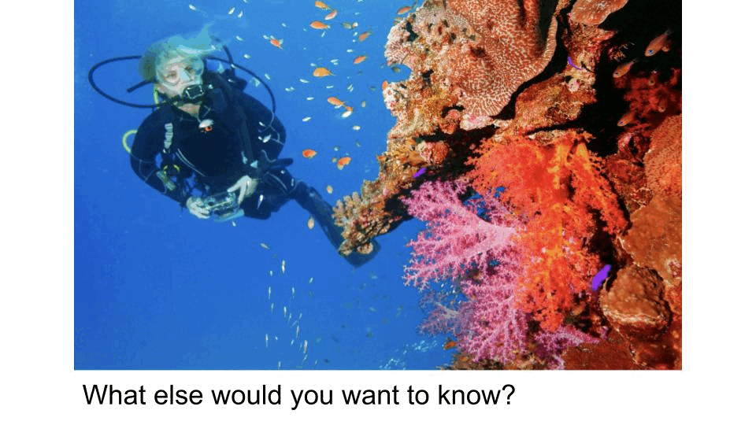

# Context-VQA: Towards Context-Aware and Purposeful Visual Question Answering

This repository includes the code and dataset for the paper [Context-VQA: Towards Context-Aware and Purposeful Visual Question Answering](https://arxiv.org/abs/2307.15745).

To download the initial version of our dataset, please navigate to [ContextVQA_dataset/](https://github.com/nnaik39/context-vqa/tree/master/ContextVQA_dataset) for more information.

To replicate our analyses in the paper, please navigate to [scripts/](https://github.com/nnaik39/context-vqa/tree/master/scripts) for more information.

## Abstract 
Visual question answering (VQA) has the potential to make the Internet more accessible in an interactive way, allowing people who cannot see images to ask questions about them. However, multiple studies have shown that people who are blind or have low-vision prefer image explanations that incorporate the context in which an image appears, yet current VQA datasets focus on images in isolation. We argue that VQA models will not fully succeed at meeting people’s needs unless they take context into account. To further motivate and analyze the distinction between different contexts, we introduce Context-VQA, a VQA dataset that pairs images with contexts, specifically types of websites (e.g., a shopping website). We find that the types of questions vary systematically across contexts. For example, images presented in a travel context garner 2 times more “Where?” questions, and images on social media and news garner 2.8 and 1.8 times more “Who?” questions than the average. We also find that context effects are especially important when participants can’t see the image. These results demonstrate that context affects the types of questions asked and that VQA models should be context-sensitive to better meet people’s needs, especially in accessibility settings.

![Text at the top of the image reads, "What do you need to know?" The rest of the image is split into two columns, each with the same picture of a woman with braids pulling a suitcase along a cobblestone road. The left column is labeled "Social Media," and underneath the picture of the woman, the text reads: "Question: Are there other people with her? Answer: There are other people in the background far behind her, but she's walking alone." The right column is labeled "Shopping," and underneath the picture of the woman, the text reads: "Question: What type of suitcase is it? Answer: I do not know but it appears to be medium sized"](img/example_1.png)

## Examples

The Context-VQA dataset features six contexts: Travel, Shopping, Health, Social Media, News, and Science Magazines. Prior research has shown that the context in which the image appears affects the kinds of questions asked, as well as the details required to be provided in the model's answer. For further information on this work, please refer to [Stangl et al (2021)](https://dl.acm.org/doi/fullHtml/10.1145/3441852.3471233) and [Stangl et al (2020)](https://dl.acm.org/doi/10.1145/3313831.3376404). We present an example of how this might apply to the VQA domain below.

### Example 1


This image shows a scuba diver near a coral reef. The description in the GIF was generated by BLIP-2.

#### Case 1: Travel

Imagine you are browsing a **travel website**, with the goal of traveling to a new location, when you encounter this image. In this case, imagine that you cannot see the image directly, and that you only have access to the image description. What else would you need to know about this image?

Question: Where is the scuba diver

Answer: Underwater near some small fish, corals, and other sea life.

#### Case 2: Science Magazines

Imagine you are browsing a **science magazine**, with the goal of learning more about recent scientific developments, when you encounter this image description. Again, assume that the only information you have is the image description. What else would you need to know about this image, and how might those information needs change?

Question: Is there any fish or animals in the photograph?

Answer: Yes. There are small fish with orange-golden scales floating between the diver and the coral.

## Citation

If you use the Context-VQA dataset, you can cite our work as follows.

```
@inproceedings{Naik-etal:2023,
    author = {Naik, Nandita and Potts, Christopher and Kreiss, Elisa},
    url={https://arxiv.org/abs/2307.15745},
    booktitle={Proceedings of the IEEE/CVF International Conference on Computer Vision (ICCV) Workshops}
    year = {2023},
    title = {{Context-VQA}: Towards Context-Aware and Purposeful {Visual} {Question} {Answering}}}
```

## Contact

For any questions, please contact nanditan@cs.stanford.edu. We welcome any feedback and will do our best to incorporate it.
