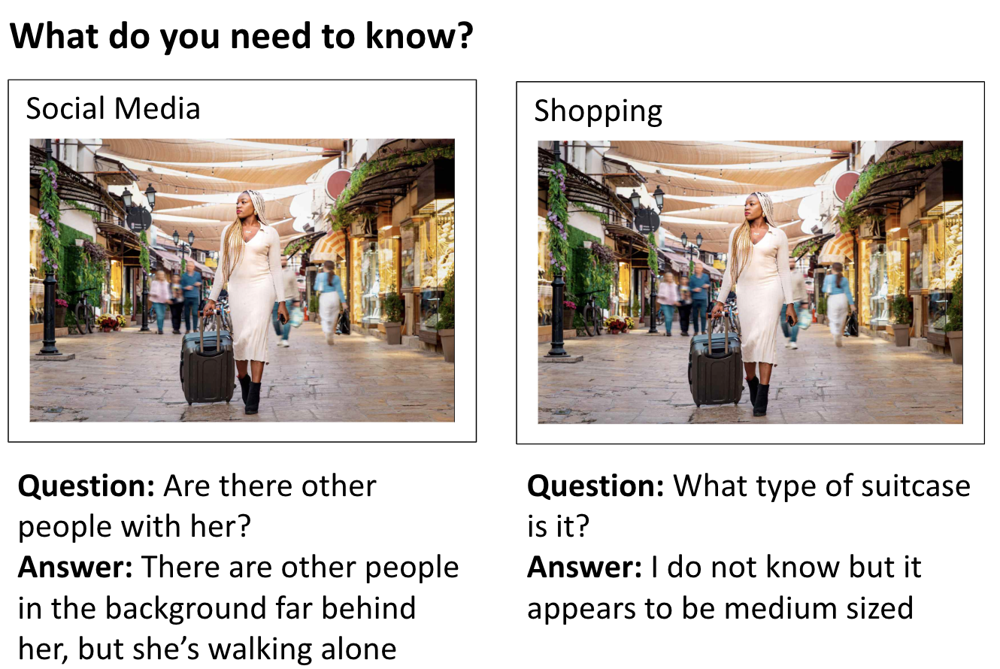

# Context-VQA: Towards Context-Aware and Purposeful Visual Question Answering

This repository includes the code and dataset for the paper [Context-VQA: Towards Context-Aware and Purposeful Visual Question Answering](https://arxiv.org/abs/2307.15745).

To download the initial version of our dataset, please navigate to ContextVQA_dataset/

To access the code necessary to replicate our figure showing the distribution of question types, run: python3 bar_plot.py.



## Examples

## Dataset Format

The data is stored in this format:
k

## Citing Context-VQA

If you use the Context-VQA dataset, you can cite our work as follows.

```
@inproceedings{Naik-etal:2023,
    author = {Naik, Nandita and Potts, Christopher and Kreiss, Elisa},
    url={https://arxiv.org/abs/2307.15745},
    booktitle={Proceedings of the IEEE/CVF International Conference on Computer Vision (ICCV) Workshops}
    year = {2023},
    title = {{Context-VQA}: Towards Context-Aware and Purposeful {Visual} {Question} {Answering}}}
```

## Contact

For any questions, please contact nanditan@cs.stanford.edu. We welcome any feedback and will do our best to incorporate it.
